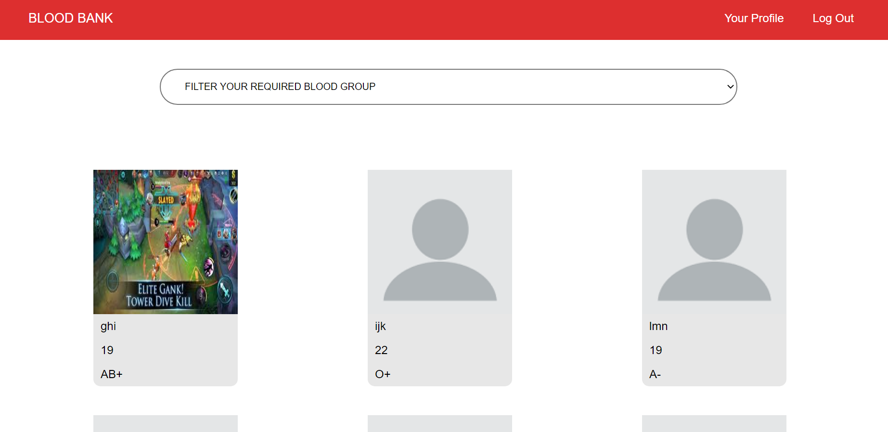

# BLOOD BANK APPLICATION

A little info about your project and/ or overview that explains what the project is about.
This project is made by me as a university project. I was a C# guy but seeing the usefulness of javascript i wanted to get into javascript with the eventual goal of becoming a MERN stack developer. This project gave me a proper launcing pad for getting into javascript from C#.

## Motivation

Learning a new language especially when you are shifting from one of your favourite language (C# in my case) can be tough. Now in a university project, one has to deliver the application by hook or by crooks, so i thought that when the pressure would be on me maybe i will learn the MERN stack quicker than normal and in an application like Blood Bank i would learn a lot of new things along the way which is exactly what happen and hence this application is made 

## Screenshots

### LoginPage

### signupPage

### dashboardPage 

### dashboardPage2

### myProfile

### messageNotificationDropDown 

### notificationDropDown

## Tech/framework used

This project uses the MERN stack which is Mongodb, ExpressJS, ReactJS, and NodeJS.

### Built with

This project is built in vs code on the Windows 10 platform
    
## Features

In this project one can:
1. Comment on other people profile
2. Change the profile picture
3. Request and decline blood donation request
4. View Other Users Profile

## Installation and Usage

Provide step by step series of examples and explanations about how to get a development env running.

### Credits

This project is made only because of a couple of youtube channels namely 
1. NetNinja (link: https://www.youtube.com/channel/UCW5YeuERMmlnqo4oq8vwUpg) and
2. DevEd (link: https://www.youtube.com/channel/UClb90NQQcskPUGDIXsQEz5Q) 
and also due to my two of of my awesome instructors
Sir Muhammad Danish Siddique (github_link: https://github.com/mdanishs) and
Sir Syed Saad Ahmad (github_link: https://github.com/syedsaadahmed)

 © Syed Haider Imam Abidi
